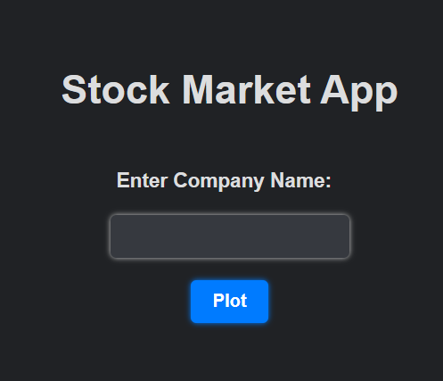
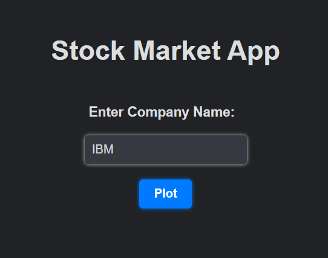
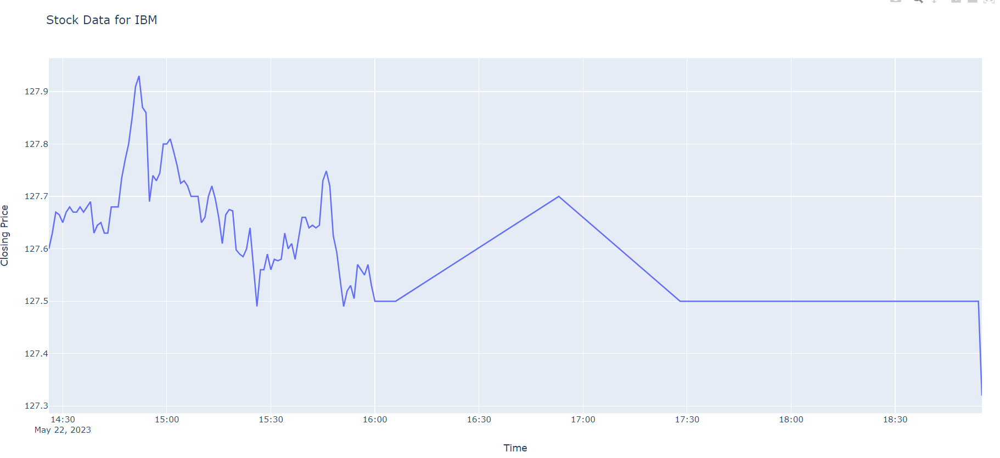

# Stock Market Visualization Flask App
This is a simple Flask application that allows users to enter the name of a company and visualize its stock market data using Plotly.

## Prerequisites
* Python 3.x
* Flask
* alpha_vantage library
* plotly library
## Installation
1. Clone the repository:

```
git clone <repository_url>
```
2. Navigate to the project directory:

```
cd stock-market-visualization
```
3. Install the required dependencies using pip:

```
pip install -r requirements.txt
```
### Usage
1. Set your Alpha Vantage API key in the api_key variable in the app.py file.

2. Start the Flask development server:

```
python app.py
```
3. Open your web browser and go to http://localhost:5000.

4. Enter the name of a company in the input field and click "Submit".

5. The application will retrieve the stock market data for the specified company and display a plot of the closing prices over time.

6. To view the plot for a different company, simply enter a new company name and click "Submit" again.

## Automatic HTML File Cleanup
The application includes a script, cleanup_html_files.py, that runs automatically every hour to remove all HTML files in the templates directory except index.html and plot.html. This helps to prevent the accumulation of unnecessary HTML files.

## Contributing
Contributions are welcome! If you find any issues or have suggestions for improvement, please open an issue or submit a pull request.

## Demo

* The starting UI looks something like this:



* Searching Up for stock results for 'IBM'



* Search Up **IBM** hovering over the line graph you can see the price registered as well.



The plot over time is displayed.

## License
This project is licensed under the MIT License.